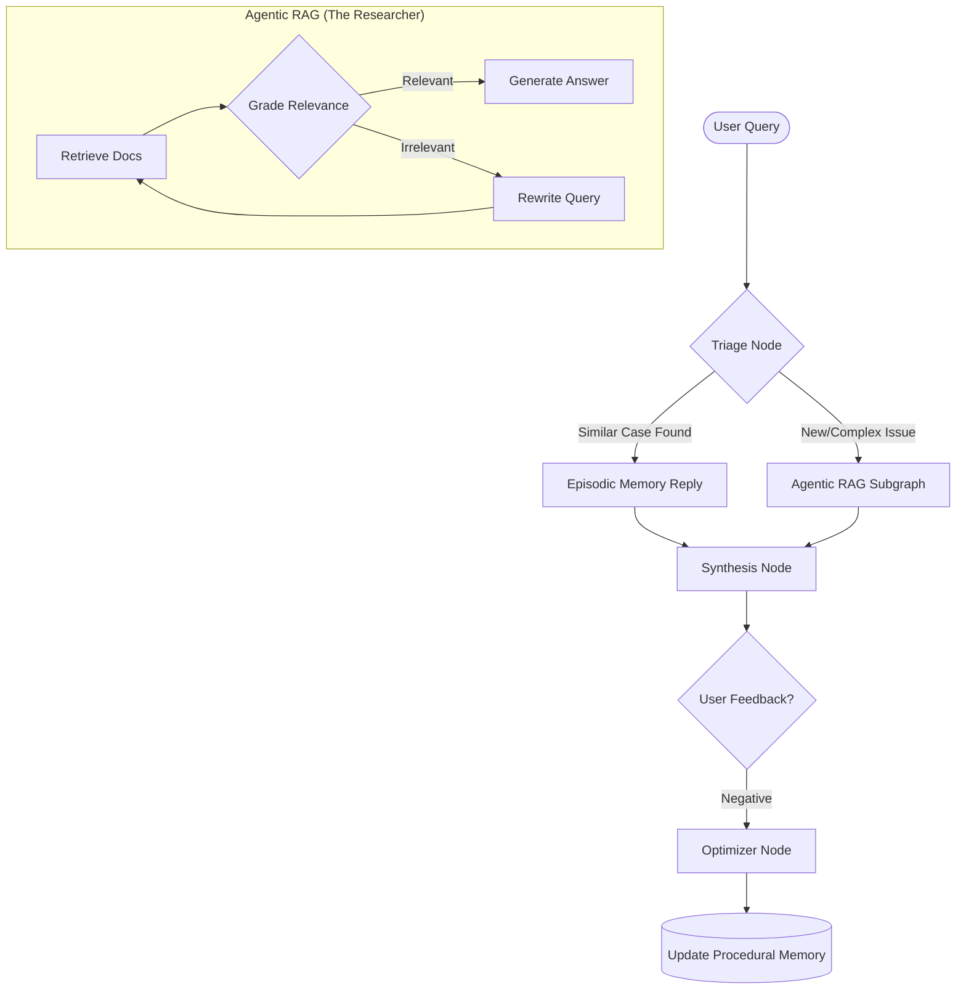
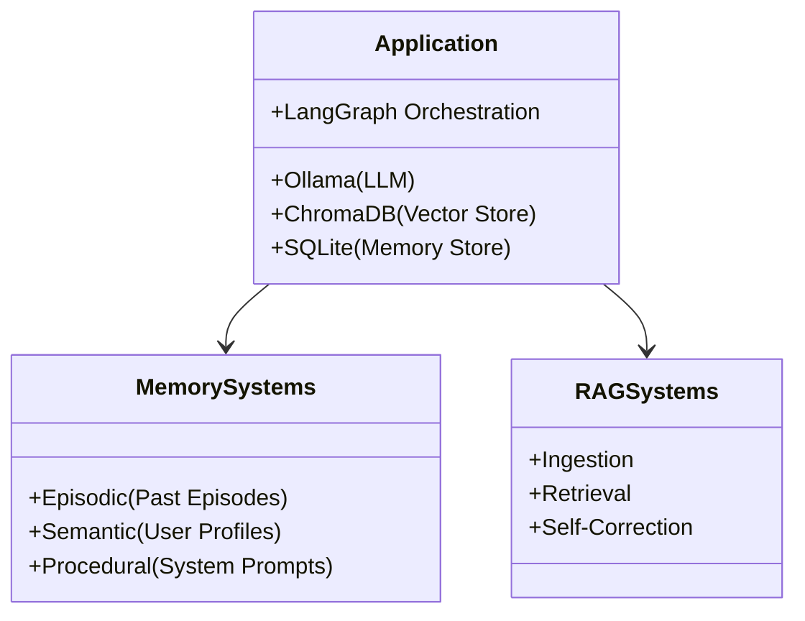

# Email-Assistant: Self-Evolving Support Agent 🧠

> **A Resume-Driven AI Project merging Agentic RAG with Advanced Memory Systems.**

## 📖 Overview
**Email-Assistant** is an autonomous support agent designed to simulate a senior support engineer. Unlike traditional RAG systems that are stateless and often repetitive, Email-Assistant **learns from experience**.

It combines two powerful AI paradigms:
1.  **Agentic RAG (Retrieval-Augmented Generation)**: Capable of researching documentation, grading its own retrieval, and self-correcting if it finds irrelevant information.
2.  **Advanced Memory Systems**:
    -   **Episodic Memory**: Remembers past similar tickets to avoid re-researching solved problems.
    -   **Procedural Memory**: Updates its own system prompts based on feedback (e.g., "Learn that API 404 errors need a specific check").
    -   **Semantic Memory**: Maintains user profiles to personalize responses.

**Built entirely on Open Source & Free Tier technologies.**

## 🏗️ Architecture

The system is orchestrated using **LangGraph**, treating the flow as a state machine.

### High-Level Logic Flow



### Component Stack



## 🛠️ Tech Stack
-   **Orchestration**: [LangChain](https://python.langchain.com/) & [LangGraph](https://langchain-ai.github.io/langgraph/)
-   **LLM Runtime**: [Ollama](https://ollama.com/) (Llama 3 / Mistral)
-   **Vector Store**: [ChromaDB](https://www.trychroma.com/) (Local)
-   **Database**: SQLite (for interaction history)
-   **Language**: Python 3.10+

## 🚀 Getting Started

### Prerequisites
1.  **Python 3.10+**
2.  **Ollama** installed and running (`ollama serve`).
3.  Pull the model: `ollama pull llama3`

### Installation
```bash
# Clone the repository
git clone https://github.com/MedAzizAydi080/Email-Assistant.git
cd Email-Assistant

# Install dependencies
pip install -r requirements.txt

# Setup Scaffolding
python structure_setup.py

# Run the Agent
python main.py
```

## 🧠 Memory Data Structure
-   `data/memory/episodes.db`: Stores "few-shot" examples of past successful tickets.
-   `data/prompts/`: Text files containing system prompts.
